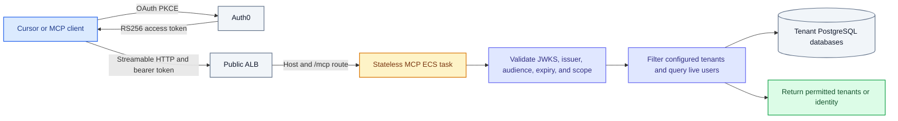
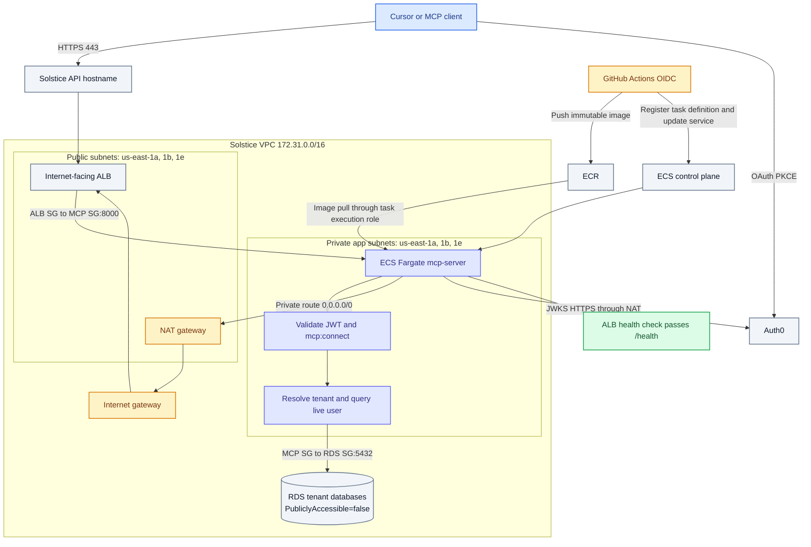

# AWS architecture

Terraform for this infrastructure stays in Backend-Server. Its existing state
owns Auth0, ECR, ECS, ALB routing, security groups, and RDS access. This
repository owns the service image and deployment workflow only.

## Request and data flow

The bearer token never leaves the MCP task. Tenant discovery runs one
read-only membership query per environment-matching tenant on a cache miss.
The query requires both `auth0_id = sub` and `deleted_at IS NULL`.

## VPC and subnet placement

Dev, staging, and platform-testing use the existing dev ECS cluster, ALB, RDS
instance, and `solstice-dev-mcp` ECR repository. Production uses the existing
prod equivalents and `solstice-prod-mcp`. Each ECS task runs in private
`solstice-private-*` subnets across three availability zones. Those subnets
egress through the existing NAT gateway for Auth0 JWKS and ECR access. The ALB
is internet-facing across three public subnets. MCP tasks have no public IP;
their service security group accepts port 8000 only from the matching ALB
security group and is the only MCP source allowed to reach PostgreSQL on 5432.

## CI deployment identity

GitHub Actions requests a short-lived OIDC token with audience
`sts.amazonaws.com`. AWS validates that token and allows
`sts:AssumeRoleWithWebIdentity` only for this repository's immutable subject in
the `dev` or `prod` GitHub environment. The resulting role session can push the
image and update ECS; no AWS access key is stored in GitHub. A subject,
audience, or signature mismatch prevents the workflow from obtaining AWS
credentials, so the deployment stops before ECR or ECS changes.
